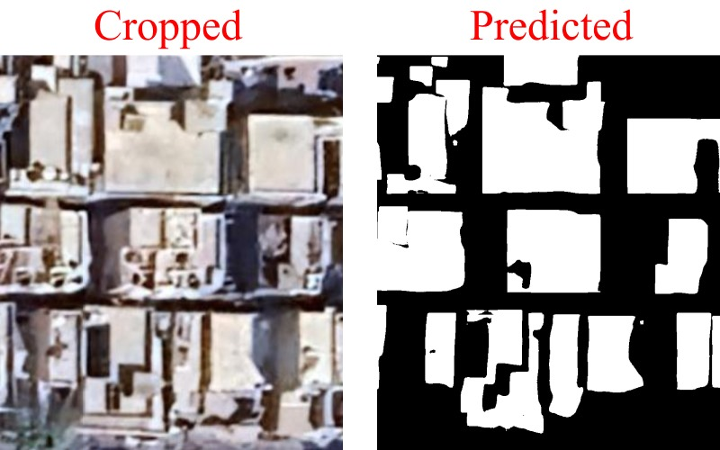

# Rooftop Detection Using Satellite Images

## Project Overview

This project focuses on detecting rooftops in satellite images using Transfer Learning and computer vision techniques. 
The primary goal is to develop an accurate and efficient model to identify and segment rooftops from high-resolution satellite imagery. 
This can be useful for urban planning, disaster management, and various other applications.

## Table of Contents

- [Project Overview](#project-overview)
- [Installation](#installation)
- [Usage](#usage)
- [Dataset](#dataset)
- [Model](#model)
- [Results](#results)

## Installation

To run this project, you need to have Python installed on your machine. Follow the steps below to set up the environment:

1. Clone the repository:
  ```
   git clone https://github.com/masoom-patel/Solar-Rooftop-Detection.git
   cd Solar-Rooftop-Detection
  ```
2. Create a virtual environment:

  ```
   python -m venv venv
   source venv/bin/activate
  ```
  #### For Windows use
  ```
    python -m venv c:\path\to\myenv
  ```


3. Install the required dependencies:
 ```
  pip install -r requirements.txt 
 ```

4. Usage:

To use the Pretrained rooftop detection model:

## Dataset
  <p>
  The dataset used for the training the YOLOv8 model can be found under the /data branch of this repository.
  The dataset was generated from Google Satellite Data using QGIS and has been stored in .TIF format.

  <br/>
  
  The TIF image has been further gridded and cropped into smaller images for better results and better predictions on visible rooftop images.
  The gridded images are further changes into JPG format for efficient and faster results as compared to TIF images due to its size of metadata.
 

## Model
  Model is internally using YOLOv8 architecture and the data has been trained onto YOLOv8-s model.
  

   
## Results
  
